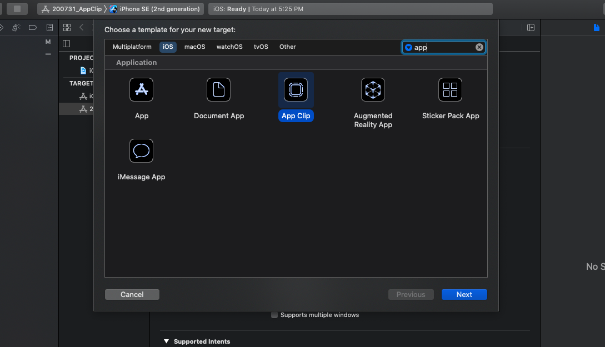
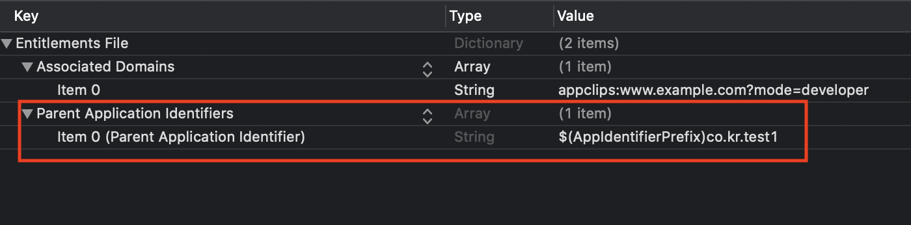
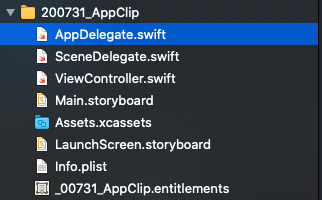
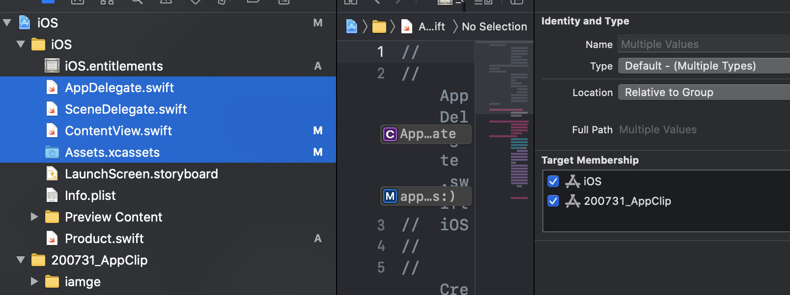
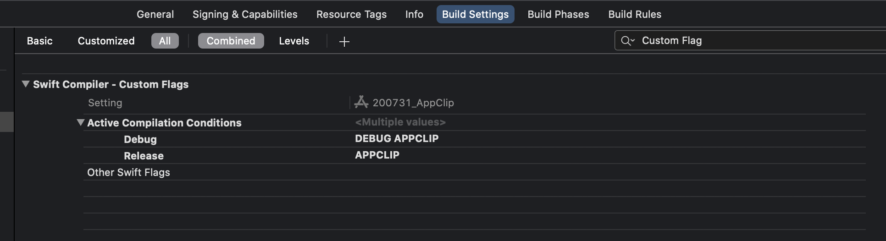
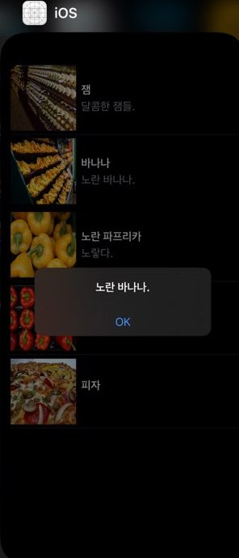
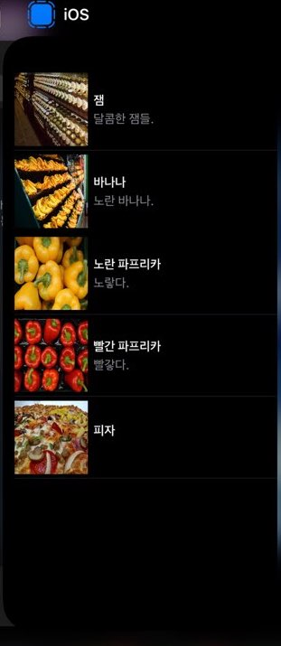
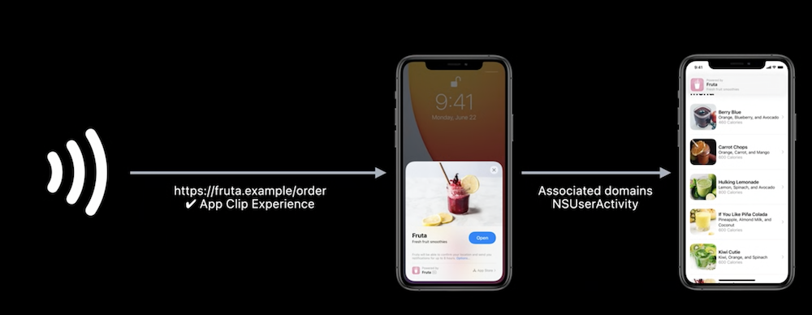
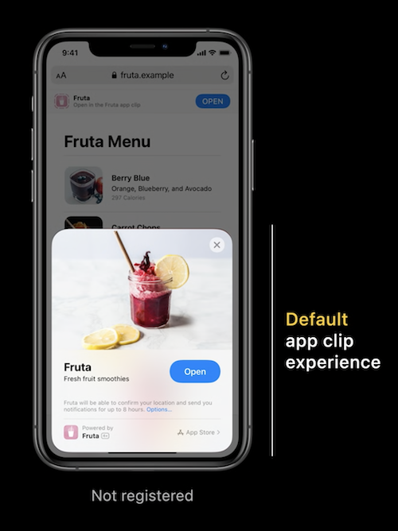

# 200731 App Clip 만들어보기. 
---


## [Human Interface Guide](https://developer.apple.com/design/human-interface-guidelines/app-clips/overview/) 

### App Clip 이란?
경량 버전 앱.
QR코드, NFC, URL로 실행 가능하다.

앱 클립은 필수 기능에 중접을 두고 단순히 광고하는 수단으로 사용되면 안된다.
앱 클립은 용량이 가벼워야한다.
앱 클립은 사용 후 계정을 만들게끔 개발해야 한다.


전체앱을 설치시 기기의 앱클립이 교체된다.
이때는 앱클립 호출시 전체앱이 실행된다.

--- 
## [Developer Document](https://developer.apple.com/documentation/app_clips/developing_a_great_app_clip/) 

전체 앱에는 하나의 앱 클립을 가질수 있고 앱 클립의 기능은 전체 앱에서 완전히 지원되어야 한다.

사용자가 앱클립을 시작시
앱클립의 메타데이터와 URL을 확인하고

URL을 이용하여
앱 클립 카드 UI를 업데이트 하게 된다.


앱클립 용량은 10MB를 넘기면 안된다.

런타임시 사용할수 없는 프레임워크가 있다.

앱클립은 앱 추적이 제한되고 (AppTrackingTransparency)
백그라운드 작업이 불가능하다.

권한은 사용중 권한 부여를 요청할수 있지만 다음날 오전 4시에 자동으로 재설정된다.
 
 
 --- 
 ## [make to App Clip!](https://developer.apple.com/documentation/app_clips/developing_a_great_app_clip/) 
 ---
 프로젝트 구성 
 전체 앱 : 상품 리스트 제공, 상품 누를시 알럿
 앱 클릭 : 상품 리스트 제공
 
 
1. 프로젝트에 app clip을  추가한다.
 
 
2. AppClip.entitlements 에 앱 식별자 접두사를 추가해준다.
 

```
1. .entitlements?
- 서비스 또는 기술을 사용할 수있는 실행 권한을 부여하는 키-값 쌍입니다.

2. $(AppIdentifierPrefix)?
 $(AppIdentifierPrefix)는 프로비저닝 프로파일에 들어있는 정보임.
 Library/MobileDevice/Provisioning Profiles 안의 파일을
 vi 편집기로 열어보면 하기 정보가 있는걸 확인할수 있다.
 
 <key>ApplicationIdentifierPrefix</key>
 <array>
 <string> {앱 식별자 접두사} </string>
 </array>
 ```
 
2. 앱클립도 기본 앱과 동일한 기본 구성 파일을 갖고 있다.
전체앱의 부분 기능으로 구성하기 위하여 해당 파일들은 날려 주었다.

 
3. 앱클릭 프로젝트에 사용될 리소스들을 Target Membership에 추가해준다.



5.만약 앱 클릭에서 제외해야할 소스가 있다면 
project file > app clip project > Build Setting > Custom Flag 에서
APPCLIP을 추가한다.



6. 소스에서 5에서 추가한 전처리기 예약어로 
앱 클릭 프로젝트에서 필요 없는 소스를 제외 시켜준다.
``` swift
#if APPCLIP
// 앱 클립일땐 미동작
#else
self.isPresent = true
#endif
```


7. 전체앱에서는 알럿이 뜨고, 앱클립에서는 안뜨는 걸 확인할수 있음.
 
 
 

 --- 
 ## [Configure and link your app clips](https://developer.apple.com/videos/play/wwdc2020/10146/)
 URL로  앱 클립에 접근 하는 것 까지 확인을 위해선 Universial link 환경이 필요하다.
 SSL 인증이 된 웹서버가 필요하기에 이 단계까지는 진행하지 못해 글로만 정리했다 ㅠㅠ
 
 
애플 개발자 사이트와 프로젝트 내에서 associated link 환경을 세팅해준다.
```
  appclips:<fully qualified domain>
```
  
  
  WebServer > apple-app-site-association
  ```javascript
  {
      "appclips": {
          "apps": [ "ABCDE12345.example.fruta.Clip" ]
      }
  }
```
  
 
  
  Universial link로 진입시 NSUserActivity를 통하여 들어온 URL을 캐치할수 있다. 
  [Access the Invocation URL](https://developer.apple.com/documentation/app_clips/responding_to_invocations) 

  
  
  추가로 웹페이지에 하기 html 구문을 넣어주면 웹에서 앱 클립을 적용해볼수 있다고 한다.
  Web page > 
```HTML
  <meta name="apple-itunes-app" 
      content="app-clip-bundle-id=com.example.fruta.Clip,
      app-id=123456789">
```
   
  

 
 
