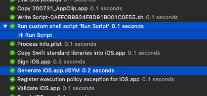
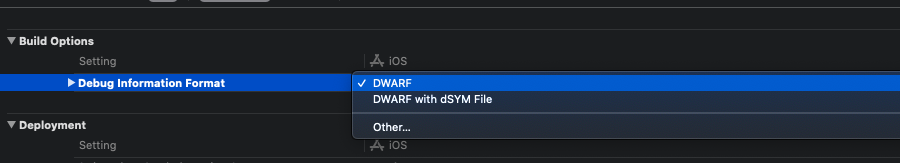

# [dSYM (debug Symbol file)](https://developer.apple.com/documentation/xcode/diagnosing_issues_using_crash_reports_and_device_logs?language=swift)
---

``` 
컴파일러가 소스코드를 기계어로 변환할때 생성되고 

역할은 기계어를 소스코드 라인으로 매핑하는 정보를 가진 파일.
``` 

 
 _**컴파일러가 소스코드를 기계어로 변환할때 생성되고**_ 

=> 정확한 생성 시점은 빌드 로그를 확인시 볼 수 있음.


컴파일러 완료 -> 링크 후 실행파일 생성 -> run script 수행 -> .dSYM 생성



```script
# run script에서 .dSYM을 찾기 위해서는 딜레이를 주면 됨

sleep 5

if [ ! -d ${DWARF_DSYM_FOLDER_PATH}/${DWARF_DSYM_FILE_NAME} ]; then
    echo "Couldn't find dsym file"
    exit 1
fi
stat -x ${DWARF_DSYM_FOLDER_PATH}/${DWARF_DSYM_FILE_NAME}
 


output: 
Showing All Messages
  File: "/Users/user/Library/Developer/Xcode/DerivedData/project-emhwptcappbfvxagavbfxvxhtfdc/Build/Intermediates.noindex/ArchiveIntermediates/project/BuildProductsPath/Release-iphoneos/project.app.dSYM"

``` 


dSYM 파일에는 실제로 충돌 보고서를 기호화 하는데 필요한 앱의 모든 디버그 기호가 포함되어 있어

소스코드 단계로 매핑이 가능하다.
 


### 파일의 위치? 
---


```  
window > Organizer > Download Debug Symbols 

or

터미널 >
cd {경로}/Library/Developer/Xcode/Archives/2020-08-27/{파일명}.xcarchive/dSYMs

아니면 위 경로에서 {파일명}.xcarchive에서 오른쪽 클릭, 패키지 내용 보기
``` 


### Debug Information Formet
---

``` 
Xcode의 build setting에서 Debug Information Format의 설정에 따라 

Debug Symbol을 최종 바이너리에 포함시킬지, 별도의 파일로 추출되도록 할 지 설정할 수 있습니다.

```

.DSYM 파일이 만들어지면서 빌드 시간이 증가되기에 

필요하지 않다면

build setting > Debug Information Formet를 DWARF로 바꾸어주는게 좋다. 





