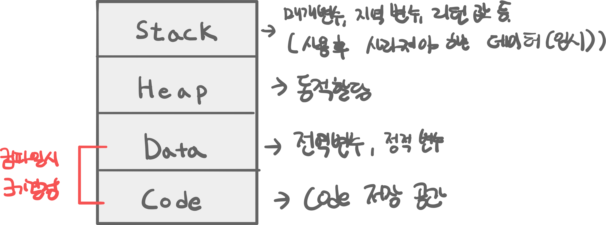

# 200912 Stack and Heap

---


## 개념

- 프로그램이 실행 될때 OS는 메모리를 할당한다.

 

Stack은 재귀함수 호출시 마지막 함수가 값을 반환하기 전까지
모든 함수의 실행이 일시 중단된다.
 
 
 
 
 
 
 
 ## Struct과 Class
 

 ```swift
class CallByRef {
    var n1: Int?
}

struct CallByVal {
    var n1: Int
    var n2: Int
}


var valTest = CallByVal(n1: 2, n2: 3)
let reValTest = valTest
var refTest = CallByRef()
var reRefTest = refTest

 
//Stack에는 다른 주소 값을 갖고, 실제로는 값으로 할당되어 있다.
//0x00007ffeefbff468
//0x00007ffeefbff450
//refTest    _00912_Staack_and_Heap.CallByRef    0x0000000103063400
//reRefTest    _00912_Staack_and_Heap.CallByRef    0x0000000103063400
withUnsafePointer(to: valTest) { Pa in print(Pa) }
withUnsafePointer(to: reValTest) { Pa in print(Pa) }


// Stack에는 다른 주소값을 갖고 있지만 Heap에서 참조하는 인스턴스는 같다.
//0x00007ffeefbff430
//0x00007ffeefbff410
//refTest    _00912_Staack_and_Heap.CallByRef    0x0000000103063400
//reRefTest    _00912_Staack_and_Heap.CallByRef    0x0000000103063400
withUnsafePointer(to: refTest) { Pa in print(Pa) }
withUnsafePointer(to:  reRefTest) { Pa in print(Pa) }
```


* 스택의 값을 클로저가 캡처시. 해당 클로저가 수행되기 전까지 Heap에서 스택의 값을 저장하고 있다. (탈출 클로저의 경우)


참고
https://devmjun.github.io/archive/Swift-StructVSClass
